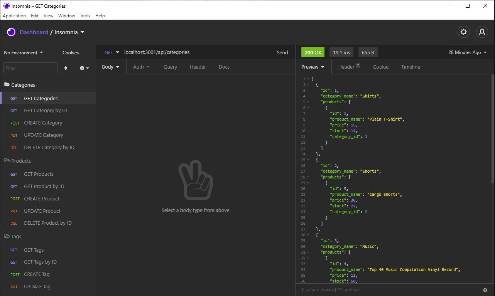
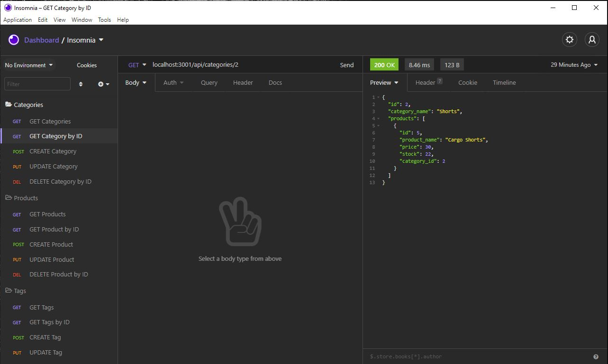
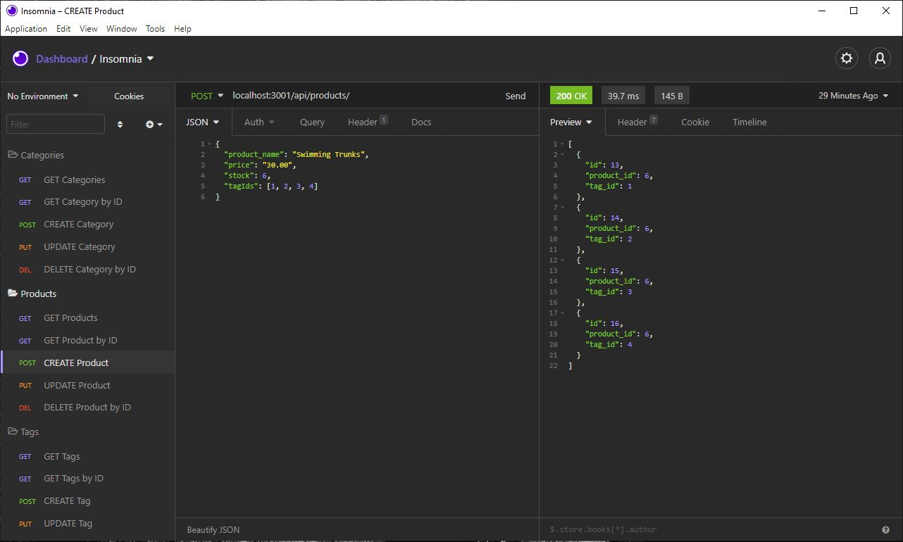
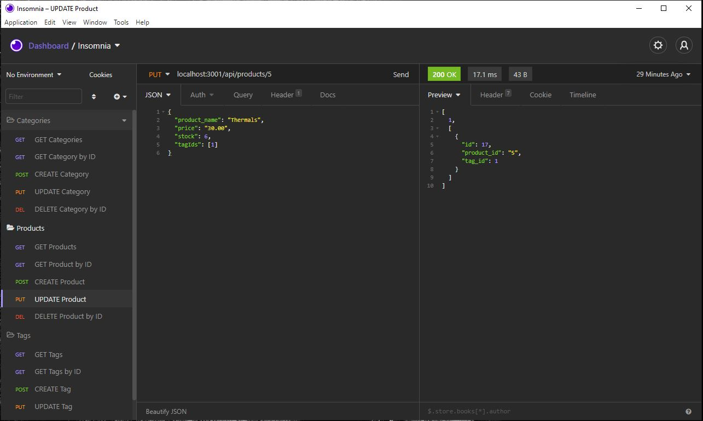
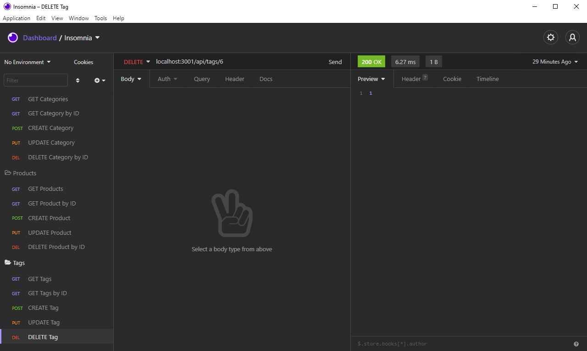

# E-Commerce Back End

  

  ## Table of Contents
  - [Description](#description)
  - [Installation](#installation)
  - [Usage Information](#usage-information)
  - [License](#license)
  - [Contribution Guidelines](#contribution-guidelines)
  - [Test Procedure](#test-procedure)
  - [Questions](#questions)
  - [Images](#images)

  ## Description
  Building the back end of an e-commerce site. It is done by configurying a working Express.js API to use Sequelize to interact with a MySQL database.

  [Video of the Application in Use](https://drive.google.com/file/d/1er-qQKq7momKfBBwxPfKUJiMCFu6ctEK/view?usp=sharing)

  ## Installation
  - npm i (to download packages)
  - npm run seed (to seed your MySQL database)
  - npm start (to start the server)

  ## Usage Information
  Use this application to build the back end for an e-commerce website that uses the latest technologies so it can compete with other e-commerce companies

  ## License
  MIT

  ## Contribution Guidelines
  Contribute freely

  ## Test Procedure
  Testing can be done by trying the different routes using Insomnia

  ## Questions
  If you have any questions, then feel free to contact me on the below:
  - Github: [bdjm94](https://github.com/bdjm94)
  - Email: [brendandjmoore@gmail.com](brendandjmoore@gmail.com)

  ## Images

| Get All Route |
|------------|
  

| Get By ID Route |
|------------|
  

| New Product Route |
|------------|
  

| Update Product Route |
|------------|
  

| Delete Route |
|------------|
  
